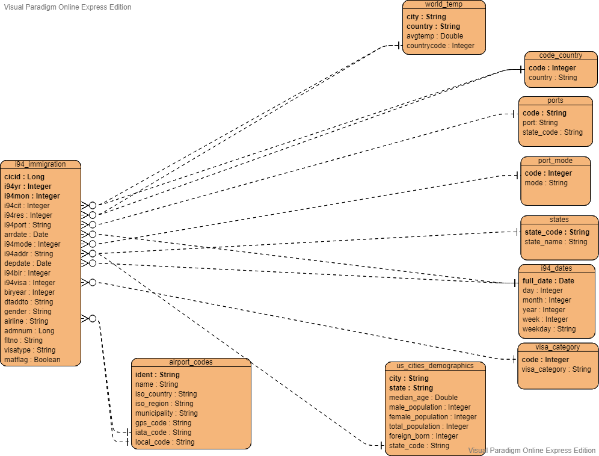

# US Immigration Analytics
### Data Engineering Capstone Project

#### Project Summary
Implements analytical tables that can answer different queries regarding immigration to different states in the US.

Project steps:
* Step 1: Scope the Project and Gather Data
* Step 2: Explore and Assess the Data
* Step 3: Define the Data Model
* Step 4: Run ETL to Model the Data
* Step 5: Complete Project Write Up

### Step 1: Scope the Project and Gather Data

#### Scope 
Explain what you plan to do in the project in more detail. 
What data do you use? 
What is your end solution look like? What tools did you use? etc

- Build a star schema with the immigration data as a fact table and dates, airport code, us city demographic and world tempreture as dimension tables.
- This will allow varies kind of analysis on the immigration data, for example what is the destination state for most USA immigrants that came from Egypt.
- I will restructure the data in the workspace using Spark, then I'm going to upload the structured data into AWS S3 using boto, finally I will create the star schema on AWS Redshift.
- I will access the tables from python and perform my queries on AWS Redshift.

#### Describe and Gather Data 
Describe the data sets you're using. Where did it come from? What type of information is included? 

I'm using 4 datasets provided by Udacity:
 - **I94 Immigration Data**
   - **Source:** https://travel.trade.gov/research/reports/i94/historical/2016.html
   - **Path in Udacity workspace:** ../../data/18-83510-I94-Data-2016/
   - There's a file for each month of the year, e.g. i94_apr16_sub.sas7bdat
   - **Full file path:** ../../data/18-83510-I94-Data-2016/i94_jun16_sub.sas7bdat
   - These files are large
   - Data are reported in a **monthly** publication highlighting overseas visitor arrivals by country of residence, ports of entry, mode of transportation, type of visa, and more.
   - **Description:** https://travel.trade.gov/research/programs/i94/description.asp , https://travel.trade.gov/research/programs/i94/index.asp
   - **Size:** 6GB
   - **Count:** 40,790,529
   - 29 Columns:

| Column   | Type   | Description                                                                                                                                                                                                                    |
|----------|--------|--------------------------------------------------------------------------------------------------------------------------------------------------------------------------------------------------------------------------------|
| cicid    | double | Id, Part of the composite primary key                                                                                                                                                                                          |
| i94yr    | double | 4 digit year of the arrival, Part of the Composite primary key                                                                                                                                                                 |
| i94mon   | double | Numeric month of the arrival, Part of the composite primary key                                                                                                                                                                |
| i94cit   | double | Visitor country of citizenship (3 digit code of origin city)                                                                                                                                                                   |
| i94res   | double | Visitor country of residence                                                                                                                                                                                                   |
| i94port  | string | Port of entry, can be in the USA or outside USA. (City, State if USA/Country otherwise)  3 character code of destination city  --> Foreign key City Temperature (City) --> Foreign key U.S. City Demographics (City and State) |
| arrdate  | double | Arrival Date in the USA, It is a SAS date numeric field                                                                                                                                                                        |
| i94mode  | double | Port mode (Air, Sea, Land, Not reported + missing values). 1 digit travel code                                                                                                                                                 |
| i94addr  | string | Landing state. --> Foreign Key to the U.S. City Demographics (State)                                                                                                                                                           |
| depdate  | double | Departure Date from the USA. It is a SAS date numeric field                                                                                                                                                                    |
| i94bir   | double | Age of Respondent in Years                                                                                                                                                                                                     |
| i94visa  | double | Visa code (Business, Pleasure, Student). Reason for immigration                                                                                                                                                                |
| count    | double | -Used for summary statistics (I think they might consider a group of visitor as 1 record and this field represent the count of the group?)                                                                                     |
| dtadfile | string | -Character Date Field - Date added to I-94 Files                                                                                                                                                                               |
| visapost | string | Department of State where Visa was issued (Where the visa was issued before arriving to USA)                                                                                                                                   |
| occup    | string | -Occupation that will be performed in U.S. (Profession)                                                                                                                                                                        |
| entdepa  | string | -Arrival Flag - admitted or paroled into the U.S.                                                                                                                                                                              |
| entdepd  | string | -Departure Flag - Departed, lost I-94 or is deceased                                                                                                                                                                           |
| entdepu  | string | -Update Flag - Either apprehended, overstayed, adjusted to perm residence                                                                                                                                                      |
| matflag  | string | Match flag - Match of arrival and departure records (If value missing -> No depature date)                                                                                                                                     |
| biryear  | double | 4 digit year of birth                                                                                                                                                                                                          |
| dtaddto  | string | Character Date Field - Date to which admitted to U.S. (allowed to stay until)                                                                                                                                                  |
| gender   | string | Non-immigrant sex                                                                                                                                                                                                              |
| insnum   | string | -INS number                                                                                                                                                                                                                    |
| airline  | string | Code of the Airline used to arrive in U.S.  --> Foreign Key to Airport Codes, IATA, and Local Code?  --> Should also use municipality column in Airport Codes                                                                  |
| admnum   | double | Admission Number is the number on a CBP Form I–94 or CBP Form I–94W, Does this mean it's unique? The answer is no                                                                                                              |
| fltno    | string | Flight number of Airline used to arrive in U.S.                                                                                                                                                                                |
| visatype | string | (B1, B2 .. etc) Class of admission legally admitting the non-immigrant to temporarily stay in U.S.                                                                                                                             |
   - There is also a data dictionary table provided for this dataset ***I94_SAS_Labels_Descriptions.SAS***, it contains some code to value mapping, and I will create a table for each map:
     - **I94CIT & I94RES:** 3 digits maps to a country name
     - **I94PORT:** 3 characters maps to city and state code or country
     - **I94MODE:** 1 digit maps to port type (Air, Sea, Land, Not reported)
     - **I94ADDR:** 2 characters maps to a USA state name
     - **I94VISA:** 1 digit maps to a visa category (Business, Pleasure, Student)
     

  
 - **World Temperature Data**
   - **Source:** https://www.kaggle.com/berkeleyearth/climate-change-earth-surface-temperature-data
   - **Path:** ../../data2/
   - **One file:** GlobalLandTemperaturesByCity.csv
   - **Size:** 509MB
   - **Count:** 8,599,212
   - 7 Columns

| Column                        | Type   | Description                                                      |
|-------------------------------|--------|------------------------------------------------------------------|
| dt                            | date   | Date: starts in 1750 for average land temperature (Can be empty) |
| AverageTemperature            | double | Global average land temperature in celsius (Can be empty)        |
| AverageTemperatureUncertainty | double | The 95% confidence interval around the average (Can be empty)    |
| City                          | string | 3448 Unique values                                               |
| Country                       | string |                                                                  |
| Latitude                      | string |                                                                  |
| Longitude                     | string |                                                                  |

  
 - **U.S. City Demographic Data**
   - **Source:** https://public.opendatasoft.com/explore/dataset/us-cities-demographics/export/
   - **Path:** us-cities-demographics.csv
   - **Size:** 252KB
   - **Count:** 2,891
   - This dataset contains information about the demographics of all US cities and census-designated places with a population greater or equal to 65,000.
   - 12 Columns 

| Column                 | Type   | Description                                                                                                        |
|------------------------|--------|--------------------------------------------------------------------------------------------------------------------|
| City                   | string | City within USA                                                                                                    |
| State                  | string | The USA State of the city                                                                                          |
| Median Age             | double | Median of the Ages of the people living in that city                                                               |
| Male Population        | int    | Number of males in the city (Can be null) (Same across different records with same city)                           |
| Female Population      | int    | of females in the city (Can be null) (Same across different records with same city)                                |
| Total Population       | int    | Sum of male and female population (Same across different records with same city)                                   |
| Number of Veterans     | int    | USA Veterans count                                                                                                 |
| Foreign-born           | int    | Number of foreign born americans                                                                                   |
| Average Household Size | double | Average number of a household                                                                                      |
| State Code             | string | Code of the sate                                                                                                   |
| Race                   | string | Race of the count (White, Asian, American Indian and Alaska Native, Hispanic or Latino, Black or African-American) |
| Count                  | int    | Count of people from the race (Races can be mixed also)                                                            |

  
 - **Airport Codes Data**
   - **Source:** https://datahub.io/core/airport-codes#data
   - **Path:** airport-codes_csv.csv
   - Simple table of airport codes and corresponding cities
   - This data is updated **nightly**.
   - **Size:** 5.8 MB
   - **Count:** 55,075
   - The airport codes may refer to either IATA airport code, a three-letter code which is used in passenger reservation, ticketing and baggage-handling systems, or the ICAO airport code which is a four letter code used by ATC systems and for airports that do not have an IATA airport code
   - 12 Columns

| Column       | Type   | Description                                                                                         |
|--------------|--------|-----------------------------------------------------------------------------------------------------|
| ident        | string | -Identifier might be the airport code? - nope, iata and local codes are the airport codes           |
| type         | string | Airport type [heliport,small_airport,closed,seaplane_base,balloonport,medium_airport,large_airport] |
| name         | string | Airport name                                                                                        |
| elevation_ft | int    | Elavation of the airport from sea level                                                             |
| continent    | string | Code for continent of the Airport [NaN, OC, AF, AN, EU, AS, SA]                                     |
| iso_country  | string | Code for country of the Airport                                                                     |
| iso_region   | string | Code for region of the Airport                                                                      |
| municipality | string | City of the Airport                                                                                 |
| gps_code     | string | Airport GPS code (Contains nulls)                                                                   |
| iata_code    | string | IATA airport code (Contains nulls)                                                                  |
| local_code   | string | ICAO airport code (Contains nulls)                                                                  |
| coordinates  | string | Airport coordinates lat., long. comma separated                                                     |
  
  
### Step 2: Explore and Assess the Data
#### Explore the Data 
Identify data quality issues, like missing values, duplicate data, etc.

- I will do a full analysis on the data sets here to understand how can I use them to create the a conceptual model.
- Please refer to the Jupyter Notebook `Capstone Project Template.ipynb` for more details, I will add the highlights here.

##### i94_immigration
- Change **cicid** type to long.
- Change **i94yr, i94mon, i94cit, i94res, i94mode, i94bir, i94visa** to int.
- Change **arrdate, depdate** to date.
- **matflag** has 2 values, (null, 'M'), need to be altered to boolean.
- Change **biryear** to int.
- Change **dmnum** type to long.
- I'm not interested in the following columns **[count,dtadfile,visapost,occup,entdepa,entdepd,entdepu,insnum]**.
- I will save the dataset as parquet and use that instead of sas format.

###### Created mapping files for these columns out of the `I94_SAS_Labels_Descriptions.SAS` file:
- **I94CIT & I94RES:** 3 digits maps to a country name.
- **I94PORT        :** 3 characters maps to city and state code or country.
- **I94MODE        :** 1 digit maps to port type (Air, Sea, Land, Not reported).
- **I94ADDR        :** 2 characters maps to a USA state name.
- **I94VISA        :** 1 digit maps to a visa category (Business, Pleasure, Student).

##### world_temp
- Drop some columns.
- Min and max values of `dt` shows that the tempreture dataset doesn't overlap with the i94 dataset, that's kinda disappointing. At least we can get the average of tempretures per city, country.
- I also want the country code to be a column here.
- Store as parquet.

##### us_cities_demographics
- Drop some columns.
- Remove duplicates.
- Store as parquet.

##### airport_codes
- Drop some columns.
- Store as parquet.

#### Cleaning Steps
Document steps necessary to clean the data

#### Performed cleaning tasks here
More details can be found in section **3.2 Mapping Out Data Pipelines**, I will just abstract the cleaning here.
- For **i94 immigration**:
  - Some columns need to be dropped
  - All column data type need to be set
  - Some values for some columns need to be altered
- For **World Tempreture**:
  - Some columns need to be dropped
  - Use average tempreture per city per country
  - Join with `code_country` to get `countrycode` column
- For **US Cities Demographics**:
  - Some columns need to be dropped
  - Remove duplicates
- For **Airport Codes**:
  - Some columns need to be dropped
  
### Step 3: Define the Data Model
#### 3.1 Conceptual Data Model
Map out the conceptual data model and explain why you chose that model

- The model consists of a fact table and 9 dimension tables
- It represents a Star Schema, which will make the joining between tables easy and clear for a business user
- Analytical queries are meant to be performed on the fact table

#### 3.2 Mapping Out Data Pipelines
List the steps necessary to pipeline the data into the chosen data model.

##### i94_immigration Table
- Use PySpark to read i94 immigration data from SAS files into a DataFrame, lets call it `df1`
- Drop the following columns from `df1` as they are not needed 
  - count
  - dtadfile
  - visapost
  - occup
  - entdepa
  - entdepd
  - entdepu
  - insnum
  - validres
  - delete_days
  - delete_mexl
  - delete_dup
  - delete_visa
  - delete_recdup
- Cast all columns to their desired types, and adjust values of `i94mode` and `matflag`
  - `i94mode`: Use 9 instead of null for missing values, use 9 instead of 0 for Not reported values
  - `matflag`: Make it boolean true if value is M, false otherwise
- Store the `df1` as Parquet file(s)
- Upload Parquet files to AWS S3 using boto
- Load the these files into the corresponding table in AWS RedShift

##### Lookup Tables
- Tables `code_country`, `ports`, `port_mode`, `states`, `visa_category` are static lookup tables.
- Upload their files to AWS S3 using boto
- Load each file to it's corresponding table in AWS RedShift

##### i94_dates Table
- We can auto-generate this table, however we don't want to create unnecessary records
- Instead of auto-generating it, we can get all the date values from `i94_immigration` table and insert it into `i94_dates` table
- We can do that after loading `i94_immigration`, we can run a query on AWS RedShift to do that for us

##### world_temp Table
- Load the CSV file into a DataFrame, lets call it `df1`
- Drop the following columns from `df1` as they are not needed 
  - AverageTemperatureUncertainty
  - Latitude
  - Longitude
- The dates in the dataset doesn't overlap with the `i94_immigration` dataset, for that we will use the **average tempreture per city, country**
- Load `code_country` into a DataFrame and join it with `df1` on `country` to get the `Country_Code`
  - _Notice:_ Code will be null for United states, since code_country.csv comes form the dataset of the immigration to the United states
- Write `df1` to a parquet file
- Upload the file to AWS S3 using boto
- Load the file into it's corresponding table in AWS RedShift

##### us_cities_demographics Table
- Load the CSV file into a DataFrame, lets call it `df1`
- Drop the following columns from `df1` as they are not needed 
  - number_of_veterans
  - average_household_size
  - race
  - count
- Dropping these columns will cause duplicated record, because there are repeated records and the only difference between them is `race` and `count`
- Drop duplicates by `city` and `state`
- Write `df1` to a parquet file
- Upload the file to AWS S3 using boto
- Load the records in this file to it's corresponding table in AWS Redshift

##### airport_codes Table
- Load the CSV file into a DataFrame, lets call it `df1`
- Drop the following columns from `df1` as they are not needed 
  - type
  - elevation_ft
  - continent
  - coordinates
- Write `df1` to a parquet file
- Upload the file to AWS S3 using boto
- Load the records in this file to it's corresponding table in AWS Redshift

### Step 4: Run Pipelines to Model the Data 
#### 4.1 Create the data model
Build the data pipelines to create the data model.

- `scripts` folder contains all the required scripts that forms the pipeline.
- The scripts should run in the following order:
  - `wrangle_data_to_model.py`: Do all the cleaning and converts the data into the target model.
  - `load_data_to_s3.py`: Upload all files to S3.
  - `create_redshift_cluster.py`: Creates the RedShift Cluster and update the Configuration file 'aws/credentials.cfg'.
  - `create_redshift_tables.py`: Uses the queries in `sql_queries.py` to drop the tables if they exist then recreate them in Redshift.
  - `load_data_to_redshift.py`: Uses the queries in `sql_queries.py` to insert the data into Redshift tables.
  - `validate_data.py`: Validate the loaded data.

#### 4.2 Data Quality Checks
Explain the data quality checks you'll perform to ensure the pipeline ran as expected. These could include:
 * Integrity constraints on the relational database (e.g., unique key, data type, etc.)
 * Unit tests for the scripts to ensure they are doing the right thing
 * Source/Count checks to ensure completeness
 
- I performed 2 data quality checks, that can be performed by the script `validate_data.py`
  - Checking the count of records in destination
  - Checking for duplicates on unique columns
 
#### 4.3 Data dictionary 
Create a data dictionary for your data model. For each field, provide a brief description of what the data is and where it came from. You can include the data dictionary in the notebook or in a separate file.

##### i94_immigration

| Column   | Type    | Description                                                                                                                                                                                                                  |
|----------|---------|------------------------------------------------------------------------------------------------------------------------------------------------------------------------------------------------------------------------------|
| cicid    | long    | Id, part of the composite primary key.                                                                                                                                                                                       |
| i94yr    | integer | 4 digit year of the arrival, part of the composite primary key.                                                                                                                                                              |
| i94mon   | integer | Numeric month of the arrival, part of the composite primary key.                                                                                                                                                             |
| i94cit   | integer | Visitor Country of Citizenship (3 digit code of origin country)                                                                                                                                                              |
| i94res   | integer | Visitor country of residence                                                                                                                                                                                                 |
| i94port  | string  | Port of entry, can be in the USA or outside USA. (City, State if USA/Country otherwise) 3 character code of destination city --> Foreign key City Temperature (City) --> Foreign key U.S. City Demographics (City and State) |
| arrdate  | date    | Arrival Date in the USA, It is a SAS date numeric field                                                                                                                                                                      |
| i94mode  | integer | Port mode (Air, Sea, Land, Not reported + missing values). 1 digit travel code                                                                                                                                               |
| i94addr  | string  | Landing state. --> Foreign Key to the U.S. City Demographics (State)                                                                                                                                                         |
| depdate  | date    | Departure Date from the USA. It is a SAS date numeric field                                                                                                                                                                  |
| i94bir   | integer | Age of Respondent in Years                                                                                                                                                                                                   |
| i94visa  | integer | Visa code (Business, Pleasure, Student). Reason for immigration                                                                                                                                                              |
| biryear  | integer | 4 digit year of birth                                                                                                                                                                                                        |
| dtaddto  | string  | Character Date Field - Date to which admitted to U.S. (allowed to stay until)                                                                                                                                                |
| gender   | string  | Non-immigrant sex                                                                                                                                                                                                            |
| airline  | string  | Code of the Airline used to arrive in U.S.  --> Foreign Key to Airport Codes, IATA, and Local Code --> Should also use municipality column in Airport Codes                                                                  |
| admnum   | long    | Admission Number is the number on a CBP Form I–94 or CBP Form I–94W, Does this mean it's unique? The answer is no                                                                                                            |
| fltno    | string  | Flight number of Airline used to arrive in U.S.                                                                                                                                                                              |
| visatype | string  | (B1, B2 .. etc) Class of admission legally admitting the non-immigrant to temporarily stay in U.S.                                                                                                                           |
| matflag  | boolean | Match flag - Match of arrival and departure records (If value missing -> No depature date)                                                                                                                                   |

##### i94_dates

| Column    | Type    | Description                                     |
|-----------|---------|-------------------------------------------------|
| full_date | date    | Primary key. Full date in the format YYYY-MM-DD |
| day       | integer | Day of the month of full_date                   |
| month     | integer | Month of the full_date                          |
| year      | integer | Year of the full_date                           |
| week      | integer | Week of the full_date                           |
| weekday   | string  | Weekday of the full_date                        |

##### code_country

| Column  | Type    | Description                                                               |
|---------|---------|---------------------------------------------------------------------------|
| code    | integer | Primary key. 3 digit code for I94CIT & I94RES in i94_immigration dataset. |
| country | string  | Country name                                                              |

##### ports

| Column     | Type   | Description                                                         |
|------------|--------|---------------------------------------------------------------------|
| code       | string | Primary key. 3 letters Port code for I94PORT in immigration dataset |
| port       | string | Port/City name                                                      |
| state_code | string | State code if the port in US otherwise Country name                 |

##### port_mode

| Column | Type    | Description                                      |
|--------|---------|--------------------------------------------------|
| code   | integer | Primary Key. For I94MODE in immigration dataset. |
| mode   | string  | Can be 'Air', 'Sea', 'Land', and 'Not Reported'  |

##### states

| Column     | Type   | Description                                                                         |
|------------|--------|-------------------------------------------------------------------------------------|
| state_code | string | Primary key. For I94ADDR in immigration dataset. Repesent the code of the US state. |
| state_name | string | Name of the US state                                                                |

##### visa_category

| Column        | Type   | Description                                           |
|---------------|--------|-------------------------------------------------------|
| code          | string | Primary key. Code for I94VISA in immigration dataset. |
| visa_category | string | Can be 'Business', 'Pleasure', and 'Student'          |

##### world_temp

| Column      | Type    | Description                                      |
|-------------|---------|--------------------------------------------------|
| city        | string  | City name. Part of the composite primary key.    |
| country     | string  | Country name. Part of the composite primary key. |
| avgtemp     | double  | Average tempreture in the city                   |
| countrycode | integer | Country code as in code_country table            |

##### us_cities_demographics

| Column            | Type    | Description                                                   |
|-------------------|---------|---------------------------------------------------------------|
| city              | string  | City within USA. Part of the composite primary key.           |
| state             | string  | The USA State of the city. Part of the composite primary key. |
| median_age        | double  | Median of the Ages of the people living in that city          |
| male_population   | integer | Number of males in the city (Can be null)                     |
| female_population | integer | Number of females in the city (Can be null)                   |
| total_population  | integer | Sum of male and female population                             |
| foreign_born      | integer | USA Veterans count                                            |
| state_code        | string  | Code of the sate                                              |

##### airport_codes

| Column       | Type   | Description                                                    |
|--------------|--------|----------------------------------------------------------------|
| ident        | string | Primary key                                                    |
| name         | string | Airport name                                                   |
| iso_country  | string | Code for country of the Airport - US                           |
| iso_region   | string | Code for the region of the Airport - Contains state code US-CA |
| municipality | string | City of the Airport - City within the state                    |
| gps_code     | string | Airport GPS code (Contains nulls)                              |
| iata_code    | string | IATA airport code (Contains nulls)                             |
| local_code   | string | ICAO airport code (Contains nulls)                             |

#### Step 5: Complete Project Write Up

* Clearly state the rationale for the choice of tools and technologies for the project.
* Propose how often the data should be updated and why.
* Write a description of how you would approach the problem differently under the following scenarios:
 * The data was increased by 100x.
 * The data populates a dashboard that must be updated on a daily basis by 7am every day.
 * The database needed to be accessed by 100+ people.
 
#### Choice of tools and technologies for the project

- PySpark
  - Spark makes representing the data as a DataFrame and wrangling it an easy task.
  - Spark can write DataFrame to parquet files.
- Parquet files:
  - I choose parquet format because it provide good file compaction, so the file size will be reduced dramatically.
  - Parquet is a columnar representation of the data, which will allow analytical queries to run fast.
  - RedShift can read from parquet.
- AWS S3
  - S3 is considered a staging area to allow RedShift to read the files uploaded there.
- AWS RedShift
  - Amazon's Datawarehouse service enables high performance for queries.
  
#### How often the data should be updated and why?

- `i94_immigration`, this can be updated monthly since new data is provided on a monthly base. We just need to load the delta (the new records) only.
- The number of records in the Lookup tables is small, this means we can overwrite the whole table in case of new values.
- `airport_codes` can be updated daily. It contains few number of records so it can be fully overwritten to ensure consistency.
- `world_temp` for this table I'm calculating the average tempreture per city per country, the number of resulted records out of this aggregation makes the size of the table small. This means we can overwrite the whole table in case of new updates.
- `us_cities_demographics` this table is also small, and we can overwrite it.

#### What if the data was increased by 100x?

In that case, we can't use PySpark on the Udacity Workspace. Instead, we can use AWS EMR, upload the data to AWS S3, then process it using Spark on our EMR cluster. This will also allow us to write directly to RedShift instead of using S3 as a staging area.

#### What if the data populates a dashboard that must be updated on a daily basis by 7am every day?

Since the most frequently updated data is the `airport_codes` (daily), then this should not be a problem. The dashboard can read directly from RedShift, meanwhile, our pipelines do any required update at 00:00 AM. This will ensure that the dashboard always contains the most recently available data.

#### What if The database needed to be accessed by 100+ people?

AWS Redshift supports 100+ connection with no issue, only one restriction a maximum of 50 concurrent queries at a time.